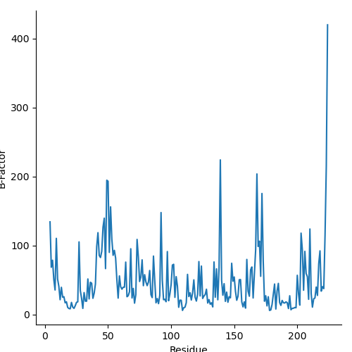

# PDB to Average B-Factors per residue

Author: Eddy BARRAUD

Contact: <eddy.barraud@outlook.fr>

Public access: [https://github.com/Eddy-Barraud/PDB2AvgBFactors](https://github.com/Eddy-Barraud/PDB2AvgBFactors)

Requirements : numpy pandas matplotlib seaborn biopython

This script is extracting B-Factor values of every PDB file in the same folder.
It will generate two files per PDB file :
- filename.resbfactors.txt : average B-Factors per residue (#	RES	 AvgValue)
- filename.resbfactors.png : plot of the calculated data

The python script behind the app is using [Seaborn](https://github.com/mwaskom/seaborn) and [BioPython](https://biopython.org/) libraries.

## Instructions

- Copy b-factor.convert.all.PDB.exe on your working directory, containing PDB file(s).
- Run b-factor.convert.all.PDB.exe and it will extract B-Factors from all PDB in the current directory.